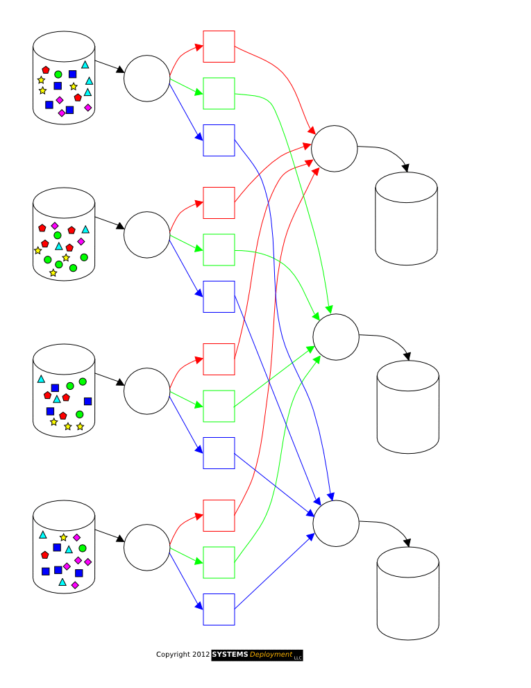

# MapReduce application with no concurrency

MapReduce is a software framework for easily writing applications which process vast amounts of data in-parallel on large clusters of commodity hardware in a reliable, fault-tolerant manner. A MapReduce job usually splits the input data-set into independent chunks which are processed by the map tasks in a completely parallel manner. The framework sorts the outputs of the maps, which are then input to the reduce tasks. Typically both the input and the output of the job are stored in a file-system.



## Problem Statement

A [input file](inputfile.txt) consisting of tuples in the form (userID, action, topic) is given. The MapReduce application has to take this file as input and process it and the final output has to be written to the standard output. The final output will be tuples of form (userID, topic, total score) where the total score is the sum of the scores of tuples whose UserID and topic are same. Here we have worked with processes only. This problem can be solved using multithreading as well. 

## Design of the application

The application consists of 3 programs.

[Mapper program:](mapper.c) This program takes in the input file which has the tuples in the form of (userID, action, topic). userID is a 4-digit identification for the users of a social media site. Action can be one of the following letters: P for posting, L for liking, D for disliking, C for commenting and S for sharing. Topic is a string of exactly 15 characters (shorter names will be padded with space). The mapper program processes these tuples to generate a weighted profile in the form (userID, topic, score) based on a set of rules which are defined as P=50, L=20, D=-10, C=30, S=40. It can be assumed that the tuples are sorted according to the UserID field but tuples that have the same userID may not be sorted according to the topic. The mapper program should output each tuple (userID, topic, score) as soon as it processes the corresponding (userID, action, topic) tuple. Also, each tuple should be output on a seperate line

[Reducer program:](reducer.c) This program gets the tuples of the form (userID, topic, score) from the standard input and generates tuples of the form (userID, topic, total score) on the standard output. Like Mapper's input, tuples are sorted according to userID field but tuples that have the same userID may not be sorted according to the topic. The reducer outputs the tuple as soon as it realizes that there won't be any more tuples that belong to the same user. It can be assumed that the reducer's input has a single tuple per line.

_Make sure that the Reducer detects the end of file character while reading from standard input._

[Combiner program:](combiner.c) This is the top level file. It makes use of fork, exec, pipe and dup2 system calls to reuse the mapper and reducer programs.

Processes are used to design reducer applications in this assignment.

## Steps to run the code

Make sure you have all the three programs in the folder from which you will be running the commands. Additionally, you must also have the input file in the same folder. 

```
- gcc -pthread -o mapper mapper.c
- gcc -pthread -o reducer reducer.c
- gcc -pthread -o combiner combiner.c
- ./combiner <inputfile.txt
```

## Author information

Shreyas Gaadikere Sreedhara, Email: shreyasgaadikere@ufl.edu

