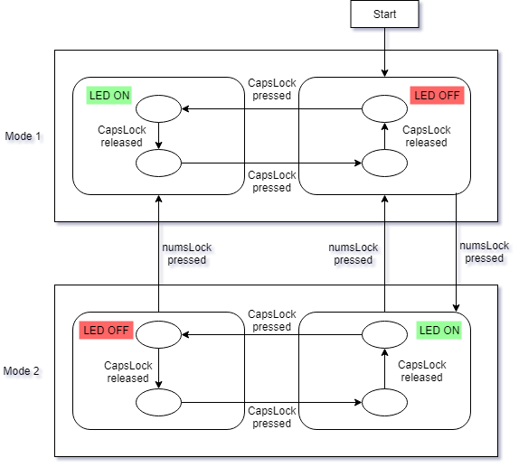

# USB legacy Keyboard Driver

A device driver is a software program that controls a particular type of hardware device that is attached to a computer. Read [here](https://www.oreilly.com/library/view/linux-device-drivers/0596005903/ch13.html) for more information about the device drivers.

## Design

The Linux USB Keyboard Driver is modified to change the way the CAPSLOCK LED is turned ON.

Here the functionalities of the CapsLock and NumLock has been changed.
In the original driver, the CAPSLOCK LED is turned ON when the CAPSLOCK key is pressed. Similarly, it is turned OFF when 
it is pressed again. This behavior repeats with each CAPSLOCK key press.

The driver will have 2 modes: ***MODE1*** and ***MODE2***.
When the driver starts working, it is in MODE1, in which the CAPSLOCK will be handled as usual.
MODE2 will be activated when NUMLOCK is pressed and CAPSLOCK is not pressed. At this point we will transition to MODE2 

When transitioning to MODE2, the CAPSLOCK LED will be turned ON automatically. MODE2 will be active until NUMLOCK is pressed again.
However, when in MODE2, CAPSLOCK LED will turn OFF when the CAPSLOCK is pressed the first time after transitioning to MODE2 and 
will turn ON when it is pressed the next time, and so on. 

In MODE2, the driver will leave the CAPSLOCK LED status in a way that will be compatible with MODE1. As a result, in MODE2, when the CAPSLOCK LED is OFF or ON you will see that the characters that are typed on the keyboard will be displayed in upper or lower case mode respectively.

## Author information

Shreyas Gaadikere Sreedhara, Email - shreyasgaadikere@ufl.edu